# PEMINJAMAN BUKU (Dokumentasi Sementara)

-- Sistem masih dalam tahap pengembangan --

## Rules

1. Terdapat 2 role yaitu admin dan user.
2. Admin dapat melakukan CRUD (Create, Read, Update, Delete) buku, kategori, dan user.
3. Dalam tabel peminjaman, admin hanya dapat menyetujui data user dan setelah disetujui tidak dapat menghapus data tersebut.
4. Data yang sudah disetujui oleh admin akan masuk ke dalam tabel pengembalian.
5. Setelah login, admin akan diarahkan ke halaman dashboard admin, sementara user akan diarahkan ke landing page.
6. Jika belum login, pengguna tidak dapat meminjam buku dan akan menerima notifikasi serta diarahkan ke halaman login.
7. Terdapat stok buku. Jika stok buku habis, buku tersebut tidak dapat dipinjam.
8. User hanya dapat melihat dan meminjam buku.
9. Maksimal buku yang sedang dipinjam adalah 3 buku . batas waktu peminjaman untuk setiap buku adalah 7 hari. Jika melebihi batas tersebut, akan dikenakan denda sebesar Rp1.000 per hari.
10. Ketika user berhasil meminjam buku, akan menunggu konfirmasi dari admin melalui email.
11. Jika admin menyetujui peminjaman buku, status peminjaman akan berubah menjadi "disetujui" dan secara otomatis akan dikirimkan email ke user.
12. Tersedia fitur riwayat peminjaman untuk user agar dapat melihat buku-buku yang telah dipinjam dan tanggal pengembalian.
13. User dapat menggunakan fitur live search di halaman daftar buku untuk mencari judul buku dan kategori
13. User dapat menambahkan dan membalas komentar pada bagian detail buku

## Tools

- Laravel 9
- PHP 8.1
- Laravel UI
- Bootstrap 5 & Icons
- SweetAlert
- AJAX
- DataTables
- Stisla Admin Template
- Select2
- CKEditor
- Swiper.js
- AOS
- MySQL
- Laragon
- DBeaver

#### (Masih dalam tahap pengembangan)

---

## Dokumentasi

1. Landing Page (sementara)

   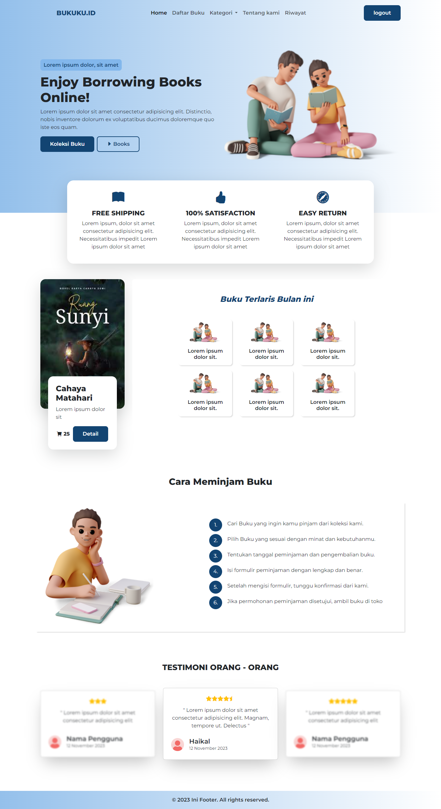

2. Login Modal

   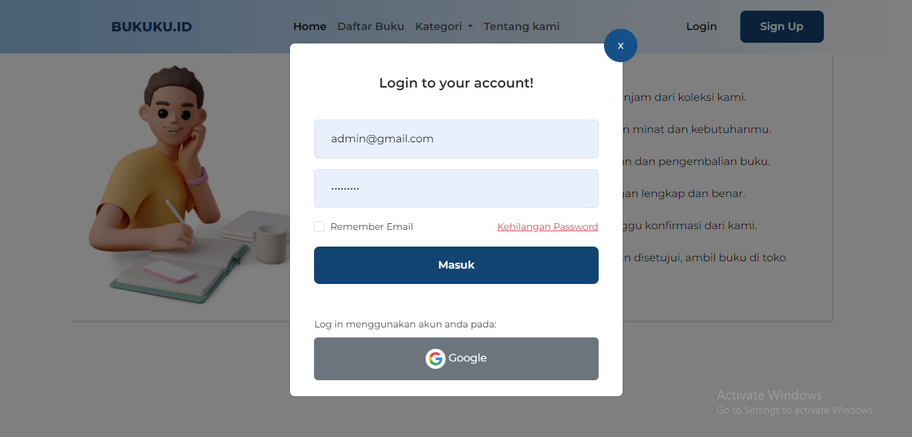

3. Halaman daftar buku

   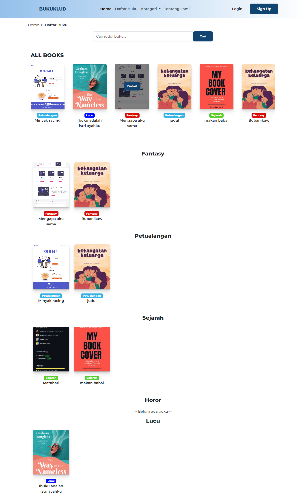

3. Detail buku dan form peminjaman menggunakan modal (user)

   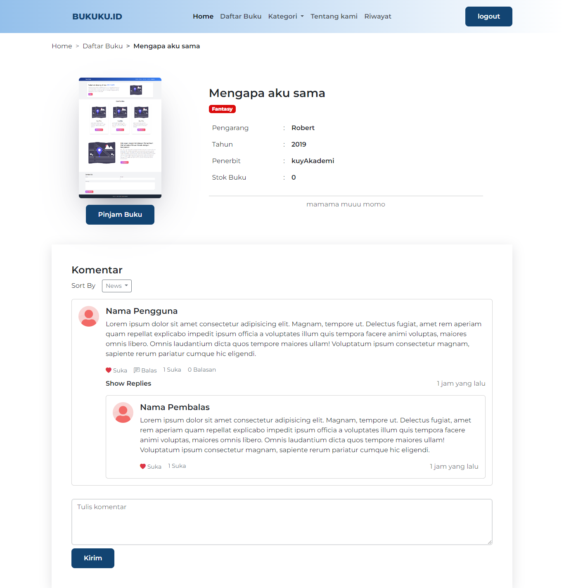

4. Riwayat Peminjaman (user)

   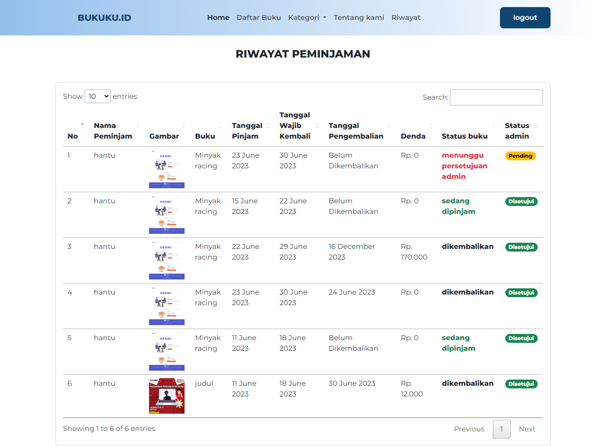

2. Halaman Table Books (admin)

   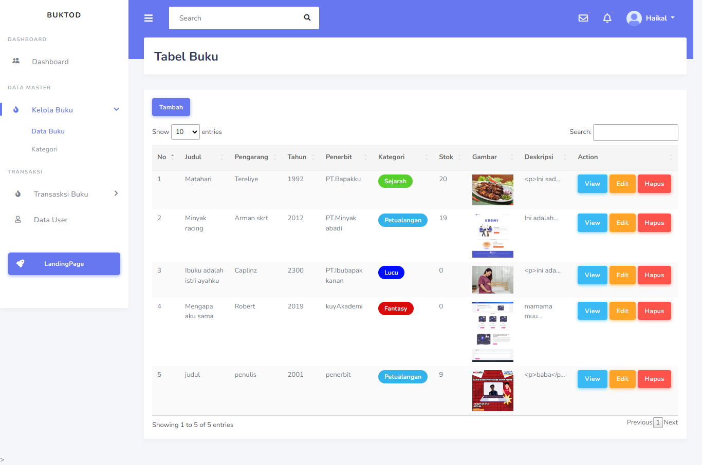

3. Halaman Table Kategori (admin)

   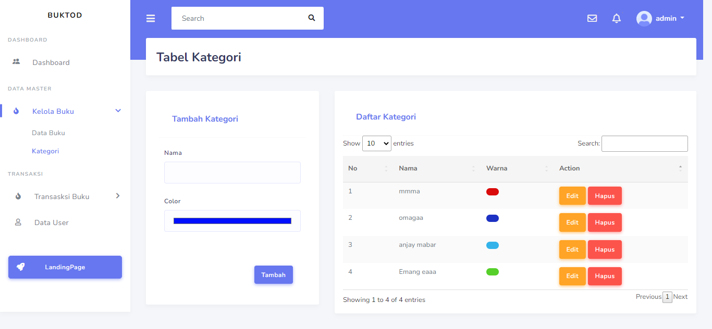

4. Halaman Tambah Buku (admin)

   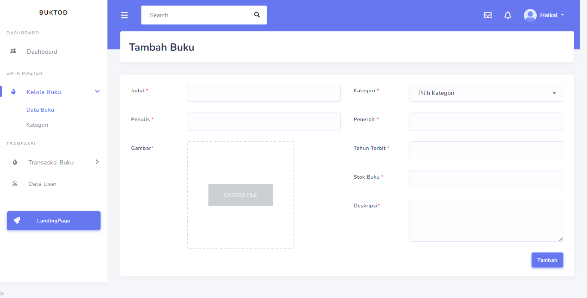

5. Halaman Table Peminjaman (admin)

   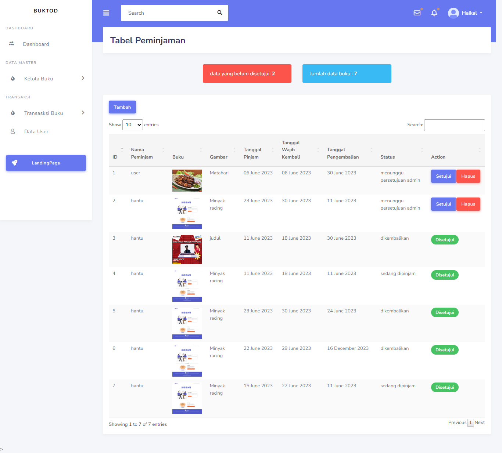

6. Halaman Table Pengembalian (admin)

   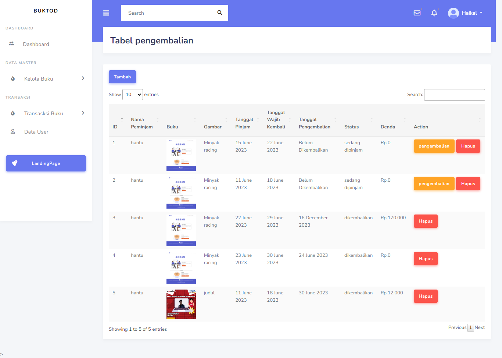

8. Halaman Table User

   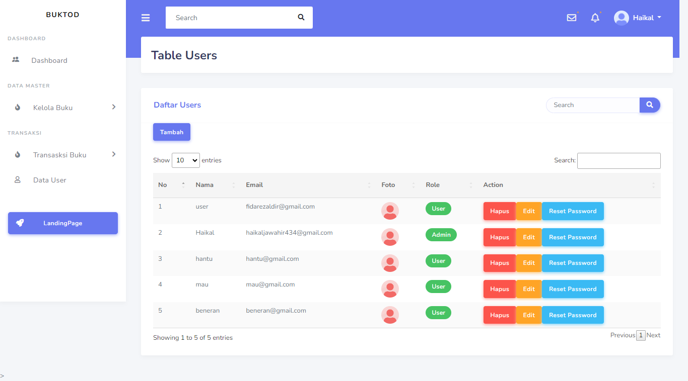
